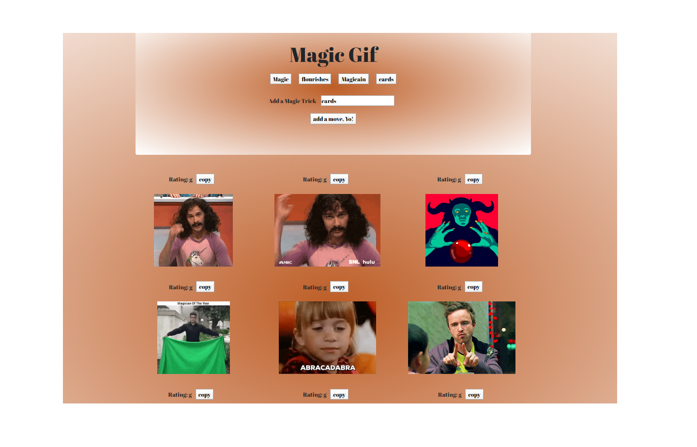

see it in Action
https://jonfinley211.github.io/letsGitGiphy/

# letsGitGiphy
an App that uses ajax to calls upon API  randomly selects gifs based upon user input. 
lets git Giphy uses giphy.com api request and then loops through the response and displays requests back on the page. 
the gifs will play and pause on click. 

## Checkout my Projects https://jonfinley211.github.io/portfolio/
